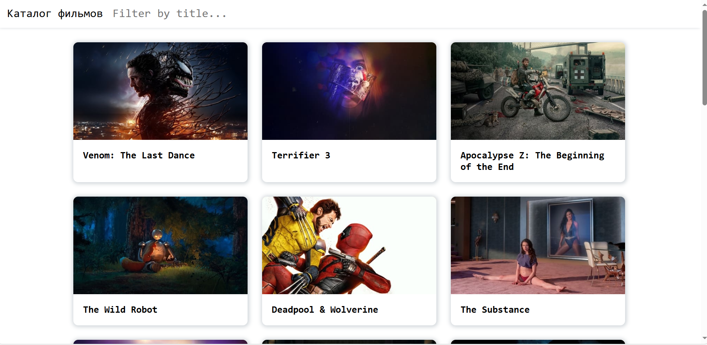

# Movies App

The **Movies App** allows users to search for movies, view detailed movie information, and create a personalized watchlist of movies they want to view in the future. It uses the **TMDb (The Movie Database)** API to fetch movie data.

## Features

### Search Functionality
- **Search by Movie Title**: Users can search for movies by typing in the title of the movie.
- **Auto-suggest**: The app displays suggested movie titles as the user types, making it easier to find what they're looking for.

### Display Movies
- **Grid Layout**: The app displays movies in a responsive grid layout, showing posters, movie titles, and release dates.
- **Sorting Options**: Users can sort the movies by popularity, release date, or rating.

### Movie Details Page
- **Detailed Information**: When a movie is clicked, a modal or new section opens with:
  - A **synopsis** of the movie.
  - **Rating and runtime**.
  - **Cast and crew** information.
  - **User reviews** (optional).
  - **Trailers or clips** (optional).

### Watchlist Feature
- **Add to Watchlist**: Users can add movies to their "Watchlist" for future viewing.
- **Local Storage**: Movies added to the watchlist are saved in local storage, so they persist even after the page is refreshed.

## API

This app uses the **The Movie Database (TMDb)** API to fetch movie data.

### Steps to Get API Key:
1. Visit the [TMDb website](https://www.themoviedb.org/).
2. Create an account or log in if you already have one.
3. Go to [TMDb API page](https://www.themoviedb.org/settings/api).
4. Apply for an API key.
5. Once approved, copy your API key.

### Set up API Key:
1. Create a `.env` file in your project directory.
2. Add the following line to the `.env` file:
   ```bash
   REACT_APP_TMDB_API_KEY=your_api_key_here

### how to run
git clone https://github.com/your-username/movies-app.git
cd movies-app
npm install
npm start

Here is a screenshot of the main page:


